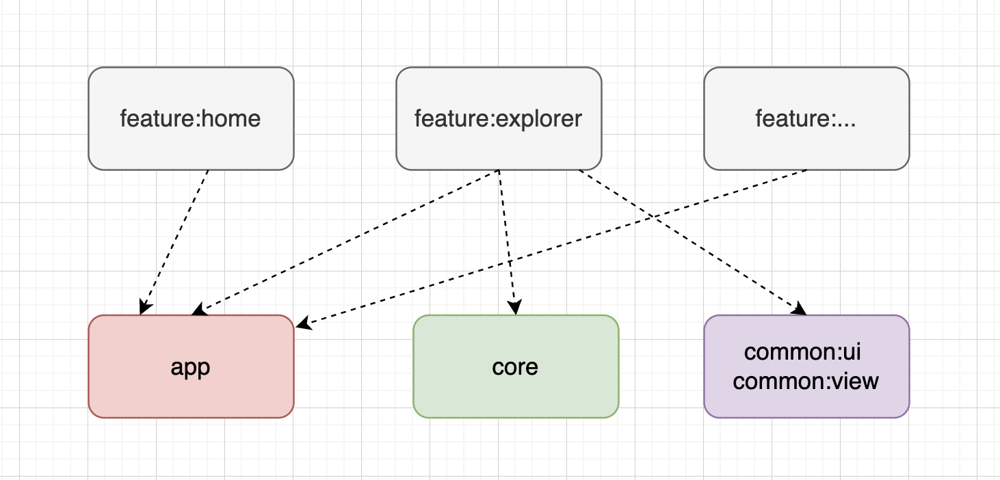

## FileManager App

The goal of the project is to make a demo for the File Manager application. An application that allows users to quickly browse and manage the files on your mobile device.

<div style="display:flex;">


</div>

## Table of Contents

- [Building application](#building-application)
    - [1. Use Android Studio](#1-use-android-studioa-nameandroid_studioa)
    - [2. Use Gradle Command](#2-use-gradle-commanda-namegradle_commanda)
- [Architecture](#architecture)
- [Resources](#resources)
- [Tech Debt](#tech-debt)
- [Next Action](#next-action)

## Building application

We can use 1 of 2 ways to build APK for the application

### 1. Use Android Studio<a name="android_studio"></a>
After synchronizing the Gradle, we can the `Edit configurations` as image below. We can run the application by press the button `Run app` from Android Studio


### 2. Use Gradle Command<a name="gradle_command"></a>

```
gradle :app:packageDebugUniversalApk
```
After running command successfully, the apk build file will located as image below. We can install the APK to the device


## Architecture

The architecture of the application is based, apply and strictly complies with each of the following points:


-   A single-activity architecture, using the [Navigation component](https://developer.android.com/guide/navigation/navigation-getting-started) to manage fragment operations.
-   Pattern [Model-View-ViewModel](https://en.wikipedia.org/wiki/Model%E2%80%93view%E2%80%93viewmodel) (MVVM) facilitating a [separation](https://en.wikipedia.org/wiki/Separation_of_concerns) of development of the graphical user interface.
-   [S.O.L.I.D](https://en.wikipedia.org/wiki/SOLID) design principles intended to make software designs more understandable, flexible and maintainable.
-   [Modular app architecture](https://proandroiddev.com/build-a-modular-android-app-architecture-25342d99de82) allows to be developed features in isolation, independently from other features.

### Modules

Modules are collection of source files and build settings that allow you to divide a project into discrete units of functionality. In this case apart from dividing by functionality/responsibility, existing the following dependence between them:

<p align="center">
 
</p>

The above graph shows the app modularisation:
- `:app` depends on`:core` and indirectly depends on `:features` by dynamic-features.
- `:features` modules depends on `:commons`, `:core`, and `:app`.
- `:core` and `:commons` has no any dependencies

#### App module

The`:app`module is an [com.android.application](https://developer.android.com/studio/build/), which is needed to create the app bundle. It is also responsible for initiating the [dependency graph](https://github.com/google/dagger).
I contains the dependencies for the whole app, including: 
- The core dependencies
- 1 Activity as the container of app and the navigation graph to navigate to other fragment of feature modules

#### Core module

The `:core`module is an [com.android.library](https://developer.android.com/studio/projects/android-library) contains the model and Core Graph to serve file utils for the other modules

#### Features modules

The `:features` module are an [com.android.dynamic-feature](https://developer.android.com/studio/projects/dynamic-delivery) is essentially a gradle module which can be downloaded independently from the base application module. 

A feature module is independent with other feature module. It can hold the full source code including view, viewmodel.
Currently, we just use the `feature:app` but I let the `feature:home` as the container of other features. (Normal application usually has home page with many features inside)

<p align="center">
 
</p>

#### Commons modules

The `:commons` modules are an [com.android.library](https://developer.android.com/studio/projects/android-library) only contains code and resources which are shared between feature modules. Reusing this way resources, layouts, views, and components in the different features modules, without the need to duplicate code.

## Resources

### Projects

This is project is a sample. Visit these interesting projects:

- [iosched](https://github.com/google/iosched) (by [google](https://github.com/google)) - official Android application from google IO 2019.
- [architecture-components-samples](https://github.com/android/architecture-components-samples) (by [android](https://github.com/android)) - collection of samples for Android Architecture Components.
- [architecture-sample](https://github.com/android/architecture-samples) (by [android](https://github.com/android)) - collection of samples to discuss and showcase different architectural tools and patterns for Android apps.
- [android-modular-architecture](https://github.com/vmadalin/android-modular-architecture) (by [vmadalin](https://github.com/vmadalin)) - Android Components Architecture in a Modular Word
- [android-kotlin-clean-architecture](https://github.com/sanogueralorenzo/Android-Kotlin-Clean-Architecture) (by [sanogueralorenzo](https://github.com/sanogueralorenzo)) - android sample Clean Architecture app written in Kotlin.
- [Clean architecture with Dynamic-features and Hilt/Dagger2](https://github.com/PedroOkawa/app-blockchain-mkt) (by [PedroOkawa](https://github.com/PedroOkawa)) - app following best practices: Kotlin, coroutines, Clean Architecture, feature modules, tests, MVVM..

### Articles

A collection of very interesting articles related last android community tendencies and recommendations for start to take in consideration for current/next project:

- [Patchwork Plaid — A modularization story](https://medium.com/androiddevelopers/a-patchwork-plaid-monolith-to-modularized-app-60235d9f212e)
- [THE ABC OF MODULARIZATION FOR ANDROID IN 2021](https://www.droidcon.com/2021/06/28/the-abc-of-modularization-for-android-in-2021/)
- [Android Modularisation using Clean Architecture and other Components](https://princessdharmy.medium.com/android-modularisation-using-clean-architecture-and-other-components-9ee44b061e9f)
- [Android Modularisation using Clean Architecture and other Components](https://princessdharmy.medium.com/android-modularisation-using-clean-architecture-and-other-components-9ee44b061e9f )
- [Dependency injection in a multi module project](https://medium.com/androiddevelopers/dependency-injection-in-a-multi-module-project-1a09511c14b7)
- [Dynamic feature and regular modules using Dagger2](https://blog.q42.nl/dynamic-feature-and-regular-modules-using-dagger2-12a7edcec1ff)
- [Migrating from LiveData to Kotlin’s Flow](https://medium.com/androiddevelopers/migrating-from-livedata-to-kotlins-flow-379292f419fb)
- [Gradle dependency management with Kotlin (buildSrc)](https://proandroiddev.com/better-dependencies-management-using-buildsrc-kotlin-dsl-eda31cdb81bf)

## Tech Debt
- Dynamic feature module has some disadvantages for data binding (sometimes cannot found the resource in app module)
- Fragment manager has some issues with back stack when managing 2 fragments inside 1 fragment
